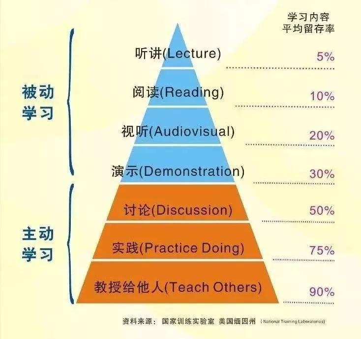

# week_004

## Algorithm

### 算法题

[子集](https://leetcode-cn.com/problems/subsets/)

```js
/*
题目：给你一个整数数组 nums，数组中元素互不相同。返回该数组所有可能的子集（幂集）。解集不能包含重复的子集。可以按任意顺序返回解集。

示例：
输入：nums = [1, 2, 3]
输出：[[], [1], [2], [3], [1, 2], [1, 3], [2, 3], [1, 2, 3]]

输入：nums = [0]
输出：[[], [0]]

提示：
1 <= nums.length <= 10
-10 <= nums[i] <= 10
nums 中所有元素互不相同
*/

/**
 * @param {number[]} nums
 * @return {number[][]}
 */
var subsets = function (nums) {
  const res = [];
  const len = nums.length;
  const temp = [];
  const dfs = (index) => {
    if (index === len) {
      // 完成遍历 合并解集
      res.push([...temp]);
      return;
    }
    // 现在nums[index]后继续递归下一数
    temp.push(nums[index]);
    dfs(index + 1);
    // 上一递归结束撤销并往下递归
    temp.pop(temp.length - 1);
    dfs(index + 1);
  }
  dfs(0);
  return res;
};
```

## Review

[7 Vue Patterns That You Should Be Using More Often](https://medium.com/js-dojo/7-vue-patterns-that-you-should-be-using-more-often-b13cde4d2ae6)

作者分享了在使用 Vue 开始需要注意的 7 种模式或方法，当然正如作者所说，这些东西在 Vue 官方文档里其实都可以找到（的确），所以也在提醒我们，要多看文档啊。

1. 使用动态或异步组件时的状态处理
2. 使用 `v-once` 指令处理低耗能的静态组件
3. 注意不要递归组件
4. 内联模版的使用
5. 动态指令参数
6. 事件和按键修饰符
7. 依赖注入

最近也在重读的 Vue 2 的文档，为学习 Vue 的源码做准备。之前学习的 Vue 的时候几乎没有从头到位好好看完 Vue 的文档过，如果想要进步，欠下的债终究还是要还滴。

## Tech/Tip

[JS 的原型和原型链理解](https://cq036pgwqz.feishu.cn/docs/doccnrv7NAkvZofdlMr03ufQj8b)

最近在准备面试，复习整理了一下 JS 的原型和原型链相关知识，整理的过程中发现自己对 JS 的理解还是不够深刻。

而且我再一次的发现，很多问题如果站在历史的角度上看，或者说了解问题出现的上下文，会对理解和学习知识有很大的助推作用。

## Share

[程序员如何把控自己的职业](https://coolshell.cn/articles/20977.html)

一篇来自耗子叔的分享。

这篇文章主要分为两个部分，第一部分主要是理论上的总结，应该怎么做，第二部分是相关的解释以及 how to。

### 第一部分

1. 大致知道这个世界的一些规律和发展趋势，认识你自己；
2. 打牢基础，以不变应万变；
3. 提升成长效率。

### 第二部分

1. 世界发展趋势：

   整个世界不断数字化，因为只要数字化，就可以进行复制传播和计算，只要可以计算，就可以进行数学建模，就可以自动化，只要可以自动化了就可以规模化，就可以改变整个行业。技术演进的规律基本是自动化➕规模化，从而降低成本，提升效率。

2. 人才需求：

   1. 技工：真正意义上的“码农”，电脑程序的操作员，随着技术门槛的下降或是技术形式的变更，他们可能会变得越来越不值钱，直接被淘汰。
   2. 特种工：必须了解和解决难题的一类人，解决一些比较难的、特定的一些技术问题。当一种技术被淘汰，他并不容易淘汰，因为他懂原理，原理就是解决问题的能力，是解决问题的套路和方法。
   3. **工程师**：不但是使用技术，还可以把活儿做好，他们认为代码更多的时间是在维护，这些人使用各种各样的手段和各种技术，精益求精地持续不断地提高代码的易读性、扩展性、可维护性和重用性，这个过程似乎永无止境。对于这些有“洁癖”，有“工匠精神”，有“修养”的技术人员，我们称他们为工程师。**这种人做事又稳又快，而且可以做出很多称手的工具和方法论**。
   4. **设计师和架构人员**：这些人主要是开发一些工具，框架，模式，提升软件开发和维护效率，同时也提升用户体验，和提升稳定性、性能、代码重用等，总的来说就是为了降本增效。这类人的工作降低了技术得到门槛，他们把技术门槛降低了以后，就可以把这个技术普及开来，就可以由广大劳工、技工、特殊工人使用了。
   5. **经理**：经理主要是组织团队、完成项目、创造利润。这类人中，即有身先士卒的leader，也有高高在上的boss，但无论怎么样，这些人只不过是为了让一个公司或是一个团队更好组织在一起的“粘合剂”，这类人只有在大公司中才会变成更有价值。

3. Google SRE 自我评分卡

   略。

4. **认识自己**：

   1. 特长：认识自己的特长，找到自己的天赋，找到你在 DNA 里比别人强的东西，拿他和别人竞争。所以要找到自己可以干成的事，比人找你请教的事。
   2. 兴趣：如果没有找到特长，就找找自己有热情，有兴趣的东西。什么叫兴趣？兴趣就是再难再累都不会放弃的事。不怕困难，痴迷其中，即使没有特长，也是头部人才。
   3. 方法：如果前两个都没有，那就要学习方法。这种方法就是要有时间观念，要会做计划，要懂得统筹和规划，对于做过的事情，犯过的错误多总结，举一反三，喜欢自己找答案，探究因果，自己总结一些套路。
   4. 勤奋：如果前面三个都没有，你还能做的事情就只有勤奋，勤奋注定会让你成为一个比较劳累的人，也是很有可能被淘汰的人。随着你的年纪越来越大，你的勤奋也会越来越不值钱。因为年轻人会比你更勤奋，斗志更强，比你要钱更少。勤奋虽然最不值钱，但只要勤奋至少能够自食其力。

5. **打好基础**：

   1. 变化都是表面的东西，内在的东西其实没有太多的变化；
   2. 在技术世界不要觉得量变会造成质变，这是不可能的，不懂原理，不懂科学方法，就不可能成长上去；
   3. 掌握技术基础可以让自己找到答案和知识，基础是抽象和归纳，要抓住原理，举一反三，对于技术基础可以分为四类：
      1. 程序语言：语言的原理，类库的实现，编程技术，编程范式，设计模式......
      2. 系统原理：计算机系统，操作系统，网管代理，调度系统......
      3. 中间件：消息队列，缓存系统，网管代理，调度系统......
      4. 理论知识：数据结构和算法，数据库范式，网络七层模型，分布式系统......

6. **学习效率**：

   

   从图中可以看到，学习可以分类两层，一种是被动学习，也是浅度学习，听讲、阅读、视听、演示都是被动学习。但是，与人讨论、自己动手实践、教授给他人都是主动学习，主动学习我们称之为深度学习，如果不能深度学习，就不能真正学到东西。这也是你会经常有“学那么多干什么，不用就忘了”，这就是浅度学习的症状。学习经验：

   1. 挑选一手知识和信息源：知识信息源非常关键，二手信息丢失太大了。目前计算机一手知识基本都是国外的，所以英文非常重要；
   2. 注意原理和基础：技术可以忘记，但是原理要记在心里；
   3. 一定要学会使用知识图谱：把知识结构化，从一个技术关键点开始不断地关联和细化下去；
   4. 学会举一反三：用不同方法学一个东西，比如学 TCP 协议，看书是一种方法，编程是另一种方法，用不同方法学一个东西，会让你更加熟悉。学一个知识的同时把周边也学了，比如学前端能不能把 HTTP 学一下（能！）；
   5. 总结和归纳：只有学会总结和归纳，才能形成自己的思维框架、自己的套路、自己的方法论，这些才永远不会被淘汰；
   6. 实践和坚持：把知识变成技能必须练，只有实践才会有经验。
